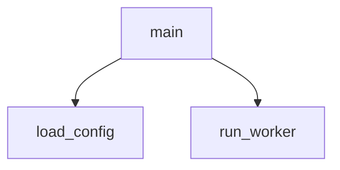

# code-path-explainer sample output

## Summary
- Indexed files: 120
- Python files parsed: 58
- Flow files produced: 58

## Sample trace
```json
[
  {
    "file": "src/example.py",
    "first_edges": [
      {"from": "main", "to": "load_config", "line": 10},
      {"from": "main", "to": "run_worker", "line": 11}
    ]
  }
]
```

## Mermaid

